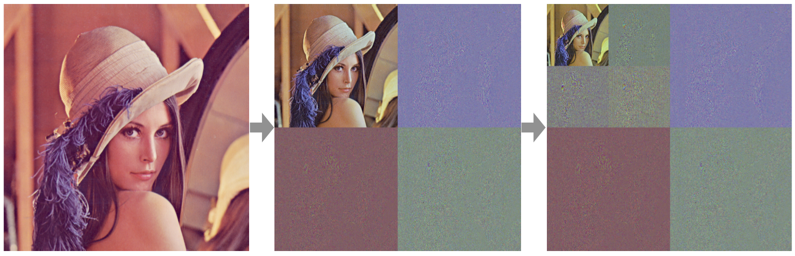
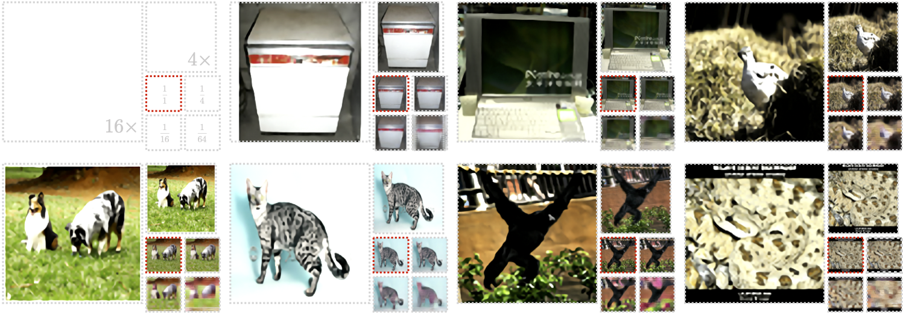
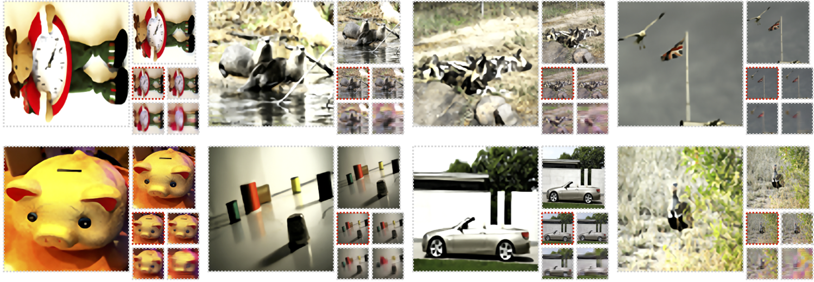
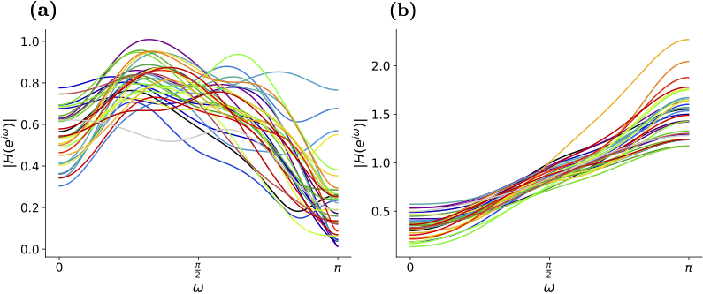

# Neural Wavelet Flow

This repo provides the original code for the paper *Learning Non-linear Wavelet Transformation via Normalizing Flow* ([arXiv:XXXX.XXXXX](https://arxiv.org/)). See a lite and cleaner version of implementation at the [lite branch](https://github.com/li012589/NeuralWavelet/tree/lite).

## Intro

Wavelet transformation stands as a cornerstone in modern data analysis and signal processing. Its mathematical essence is an invertible transformation that discerns slow patterns from fast patterns in the frequency domain, which repeats at each level. Such an invertible transformation can be learned by a designed normalizing flow model. With a factor-out scheme resembling the wavelet downsampling mechanism, a mutually independent prior, and parameter sharing along the depth of the network, one can train normalizing flow models to factor-out variables corresponding to fast patterns at different levels, thus extending linear wavelet transformations to non-linear learnable models. In this work, a concrete way of building such flows is given. Then, a demonstration of the model’s ability in lossless compression task, progressive loading, and super-resolution (upsampling) task. Lastly, an analysis of the learned model in terms of low-pass/high-pass filters is given.

## Results

### Wavelet Transformation Plot

Figure 1. Two iterations of the learned wavelet transformation, normalizations are performed for each channel for visualization. The transformation is trained on the ImageNet64 dataset and evaluated on the Lena image(512×512).



### Compression Scores

Table 1. Lossless compression scores(bits per dimension) on CIFAR-10, ImageNet32, ImageNet64.

|             | CIFAR       | ImageNet32  | ImageNet64  |
| ----------- | ----------- | ----------- | ----------- |
| NWF         | 3.59 (3.58) | 4.02 (4.01) | 3.74 (3.73) |
| NWF(in YCC) | 3.14 (3.12) | 3.53 (3.51) | 3.24 (3.24) |

Table 2. Compression scores on different datasets than trained on. Scores are actual achieved BPDs.

| Eval. on\Train on | ImageNet32 | ImageNet64 |
| ----------------- | ---------- | ---------- |
| ImageNet32        | 4.02       | 4.05       |
| ImageNet64        | 3.75       | 3.74       |

### Progressive Loading & Super-resolution 

Figure 2. Progressive loading from 1/64, 1/16, and 1/4 original size back to the original size. And super-resolution of original images to 4× and 16× size. The layout is diagramed in the first plot. The images marked with red are the original images. The original images are from ImageNet64, and the model is trained on it.

### 

### FIR Plot

Figure 3. Plot (a) and (b) are frequency responses of learned low-pass filters and high-pass filters, respectively.



## Usage

Generally, run ` python XXX.py --help` will print a detailed arguments description. And to install required libraries, using

```bash
pip install -r requirements.txt
```

A demo saving is provided in `opt` folder, the following scripts will use this saving. All plot results will be output to the saving folder's `pic` folder.

### Training

To train using the 2nd scheme defined in the paper:

```shell
python ./main.py -cuda 0 -epoch 600 -hchnl 350 -repeat 3 -nhidden 3 -target ImageNet64
```

To train using the 1st scheme defined in the paper:

```bash
python ./1DTo2Dmain.py -cuda 0 -epoch 600 -hchnl 350 -repeat 3 -nhidden 3 -init legall -target ImageNet64
```

To train on the joint dataset:

```bash
python ./jointman.py -cuda 0 -epoch 600 -hchnl 350 -repeat 3 -nhidden 3
```

### Compression

```bash
python ./encode.py -folder opt/default_easyMera_ImageNet64_YCC_True_simplePrior_False_repeat_2_hchnl_250_nhidden_2_nMixing_5_sameDetail_True_clamp_-1_heavy_False/
```

This compress script can be also used to evaluate compression scores on datasets other than trained on.

```bash
python ./encode.py -target ImageNet32 -folder opt/default_easyMera_ImageNet64_YCC_True_simplePrior_False_repeat_2_hchnl_250_nhidden_2_nMixing_5_sameDetail_True_clamp_-1_heavy_False/
```

### Wavelet Transformation Plot

```bash
python ./waveletPlot.py -img ./etc/lena512color.tiff  -folder opt/default_easyMera_ImageNet64_YCC_True_simplePrior_False_repeat_2_hchnl_250_nhidden_2_nMixing_5_sameDetail_True_clamp_-1_heavy_False/
```

### Progressive Loading & Super-resolution

```bash
python ./progressive.py -folder opt/default_easyMera_ImageNet64_YCC_True_simplePrior_False_repeat_2_hchnl_250_nhidden_2_nMixing_5_sameDetail_True_clamp_-1_heavy_False/
```

### FIR Plot

```bash
python ./FIR.py -folder opt/default_easyMera_ImageNet64_YCC_True_simplePrior_False_repeat_2_hchnl_250_nhidden_2_nMixing_5_sameDetail_True_clamp_-1_heavy_False/
```

## Citation

```latex
@article{li2021neuralwavelet,
title={Learning Non-linear Wavelet Transformation via Normalizing Flow}
author={Li, Shuo-Hui}
year = {2021},
eprint = {arXiv:XXXX.XXXXX},
}
```

## Contact

For questions and suggestions, please contact Shuo-Hui Li at [contact_lish@iphy.ac.cn](mailto:contact_lish@iphy.ac.cn).